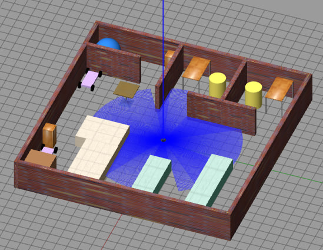
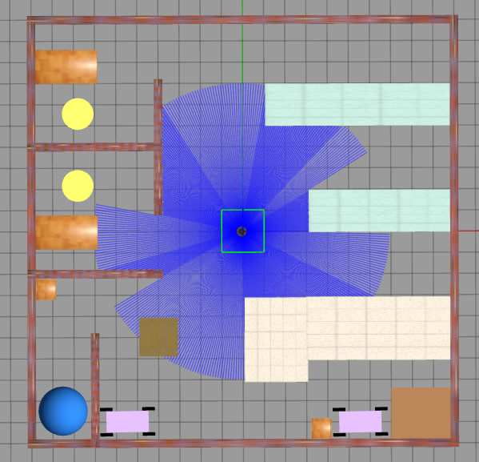
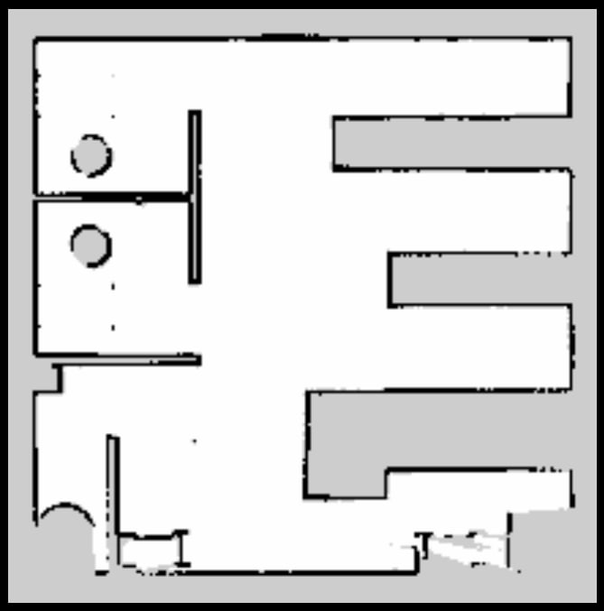
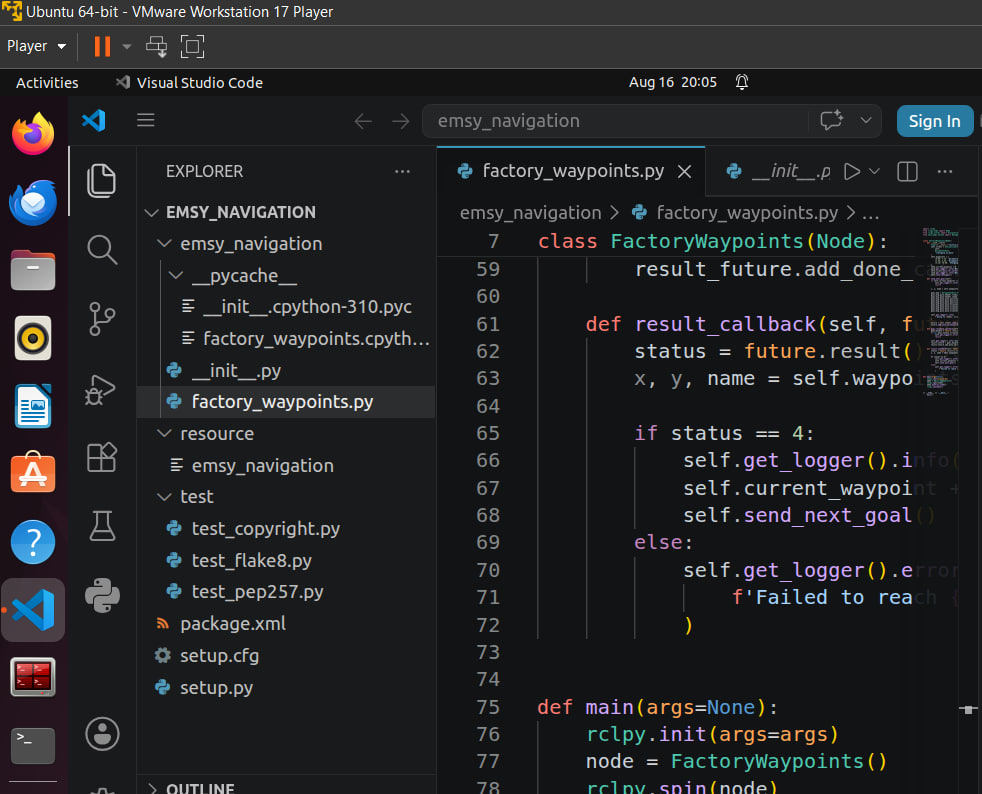
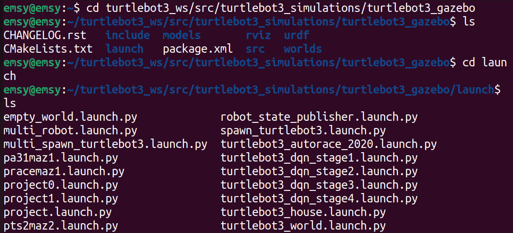
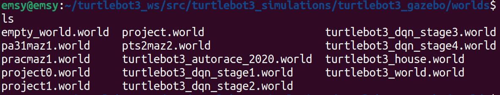

# Autonomous Factory Robot Navigation — ROS 2

A mobile robot that maps an unknown factory floor and then drives itself between
workstations without human input. A TurtleBot3 Burger builds an occupancy grid of
a custom Gazebo factory using **Cartographer SLAM**, and a ROS 2 action client
then sends it to a sequence of named waypoints through the **Nav2** stack —
replanning around obstacles that appear after the map was made.



---

## Why this problem

Warehouse and factory robots can't rely on a floorplan handed to them. Layouts
change, pallets get left in aisles, and the environment a robot was commissioned
in is not the one it operates in a month later. A robot that only follows a
pre-programmed path fails the first time something moves.

The engineering therefore splits in two: **build a map of a space you've never
seen**, then **navigate it robustly when reality no longer matches the map**.

## The factory world

The environment was built in Gazebo as a **10 m × 10 m enclosure** laid out
against the 0.5 m grid. Brick-textured walls surround the floor, and internal
partitions divide the left side into three rooms. It holds two green assembly
counters, a cream loading bay, two carts, two yellow seats and a blue sphere,
with a café table and two cabinets added as custom models. The TurtleBot3 Burger
spawns near the centre, facing open floor and tight aisles.



The layout is deliberately awkward. Wide-open floor would make navigation trivial
and prove nothing — the narrow aisles between the counters are what actually
stress both the mapping and the planner.

## Mapping with Cartographer SLAM

Cartographer was run in RViz2 while the robot was teleoperated around the
factory. Mapping was done in **slow passes** so the laser could register the
walls cleanly, and areas were **revisited so loop closure could settle**.



Before saving, the map was checked against three criteria:

- **Walls aligned** — no doubled or smeared boundaries from odometry drift
- **Boundaries closed** — no gaps the planner could try to route through
- **Full coverage** — no unexplored regions inside the working area

That check matters because the map is not a picture, it's the planner's ground
truth. A smeared wall becomes free space that the robot will happily plan a path
straight through.

## Autonomous navigation

Navigation lives in a ROS 2 Python package, `emsy_navigation`. Its
[`factory_waypoints.py`](emsy_navigation/emsy_navigation/factory_waypoints.py)
defines a `FactoryWaypoints` node acting as a **`NavigateToPose` action client**.

| Waypoint | X | Y |
|---|---:|---:|
| Workbench 1 | 0.68 | 4.14 |
| Workbench 2 | 2.34 | 1.33 |
| Charging Station | 4.18 | −3.60 |

Goals are sent **one at a time**, chained through asynchronous callbacks:

```
send_next_goal()
      │  send_goal_async()
      ▼
goal_response_callback()      ← did Nav2 accept or reject the goal?
      │  get_result_async()
      ▼
result_callback()             ← status 4 = SUCCEEDED → advance, send the next
```

Sequencing through callbacks rather than blocking is what keeps the node
responsive while Nav2 is working. The result callback inspects the returned
status: on success it logs the waypoint as reached and sends the next one;
otherwise it reports the failure and stops, rather than silently skipping ahead
to a goal the robot never actually got to.

## Problems hit, and how they were solved

**Smeared maps in the narrow aisles.** The gaps between the assembly counters
were the hardest part of the floor to map cleanly. Solved by driving more slowly
through them and re-scanning any section that came out smudged.

**Goals rejected by the planner.** Waypoints placed too close to furniture were
refused outright — the robot's footprint plus the costmap inflation radius left
no valid pose at those coordinates. Those waypoints were moved out into open
floor.

**Dynamic obstacles.** An object was placed in the robot's path mid-run to test
recovery. Nav2 picked it up in the local costmap and replanned around it, which
is exactly the behaviour the map-then-navigate approach exists to provide.

## Repository layout

The navigation package as it sits in the ROS 2 workspace:



```
emsy_navigation/
└── emsy_navigation/
    └── factory_waypoints.py       Nav2 NavigateToPose action client
```

The Gazebo world and its launch file live inside the `turtlebot3_gazebo` package
in the workspace, alongside the stock TurtleBot3 worlds:





> **Note on completeness.** `project0.world`, `project0.launch.py`, the saved map
> (`.yaml` / `.pgm`) and the package manifests live inside the Linux VM this was
> developed in, and aren't mirrored here yet. The Python node — the part holding
> the actual navigation logic — is complete.

## Running it

Requires ROS 2 with `turtlebot3`, `turtlebot3_gazebo`, `turtlebot3_navigation2`,
`nav2_bringup` and `cartographer_ros`.

**Terminal 1 — launch the factory world**

```bash
ros2 launch turtlebot3_gazebo project0.launch.py
```

**Terminal 2 — launch Nav2 with the saved map**

```bash
ros2 launch turtlebot3_navigation2 navigation2.launch.py use_sim_time:=True map:=$HOME/map/projmaz2.yaml
```

**Terminal 3 — run autonomous waypoint navigation**

```bash
ros2 run emsy_navigation factory_waypoints
```

Set the initial pose in RViz2 with **2D Pose Estimate** before starting terminal
3, so AMCL knows where the robot is on the map. Without it the robot's estimated
position and its actual position disagree, and every goal is planned from the
wrong starting point.

### Rebuilding the map yourself

```bash
ros2 launch turtlebot3_cartographer cartographer.launch.py use_sim_time:=True
```

Drive with `ros2 run turtlebot3_teleop teleop_keyboard`, then save:

```bash
ros2 run nav2_map_server map_saver_cli -f ~/map/projmaz2
```

## Technologies

**Framework** — ROS 2 (`rclpy`)
**Simulation** — Gazebo, TurtleBot3 Burger
**SLAM** — Cartographer
**Navigation** — Nav2 (`NavigateToPose`, AMCL, costmaps, recovery behaviours)
**Visualisation** — RViz2
**Language** — Python

## Possible improvements

- **No goal cancellation.** The client doesn't implement cancel handling, so a
  run can't be aborted cleanly once started. The action API supports it, and any
  real deployment would need it.
- **Waypoints are hardcoded.** Loading them from a YAML file would let routes
  change without editing source.
- **Failure stops the run.** If a waypoint fails, the whole sequence halts.
  Retrying, or skipping to the next waypoint and reporting at the end, would be
  more useful on a real factory floor.
- **No feedback subscription.** `NavigateToPose` streams distance-remaining
  feedback during execution, which the client ignores. Logging it would give
  live progress instead of silence between waypoints.
- **Single robot.** Multi-robot coordination would need namespacing and a shared
  costmap.

## License

MIT — see [LICENSE](LICENSE).
